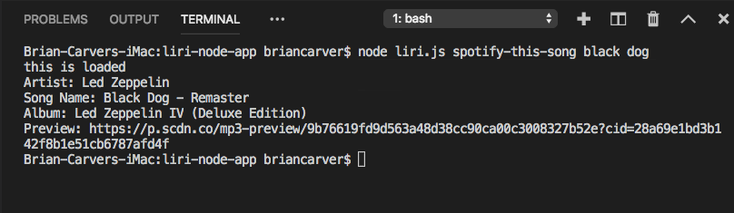

# liri-node-app
liri

* This is a command-line application that allows the user to search bands in town, a song title or a movie title.

* This application is useful becaue it allows the user access 3 different Api's.

* To get started initialize your `package.json` by running `npm init` in your application's folder

* Once a `package.json` has been created run `npm install` to import modules.

* run `liri.js` through node passing `movie-this`, `concert-this`, or `spotify-this-song` as your first argument. Enter a movie title, band name, or song name respectively as your second argument.

* This will display information in the console about the movie, band, or song that was queried. It will also add the displayed information to the `log.txt` file

* Running `liri.js do-what-it-says` will run the `random.txt` file contents as your search queries.

* spotify-this-song black dog

Format: 